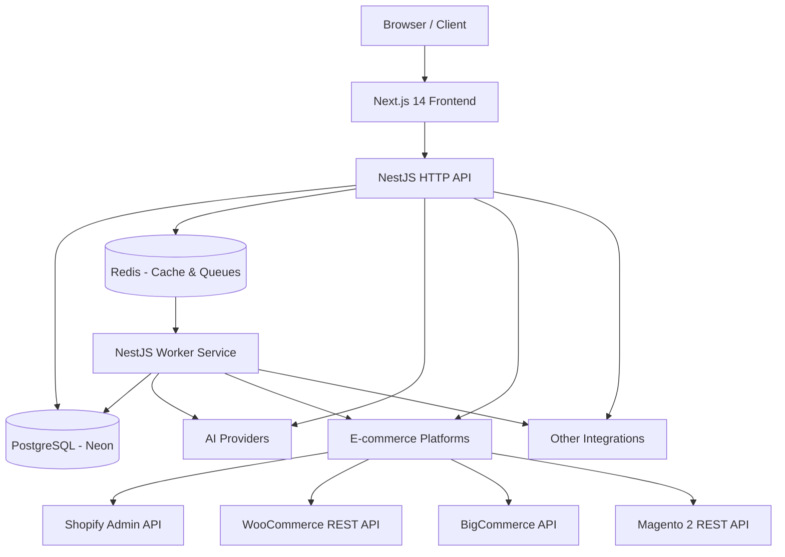

# SEOEngine.io – System Architecture

This document describes the **high-level and component-level architecture** for SEOEngine.io.

---

## 1. Overview

SEOEngine.io is an AI-powered SEO automation platform for e‑commerce merchants supporting multiple platforms (Shopify, WooCommerce, BigCommerce, Magento, and custom websites). It consists of:

- A **Next.js 14** web application (frontend).
- A **NestJS** API server (backend).
- A **PostgreSQL** database managed by Prisma.
- Optional **Redis** for caching and background job queues.
- Integrations with:
  - **Shopify Admin API**
  - **WooCommerce REST API**
  - **BigCommerce API**
  - **Magento 2 REST API**
  - **AI providers** (OpenAI, Gemini)
  - **Google Search Console / GA4** (future)

Deployment targets:

- **Frontend:** Vercel (Next.js app)
- **Backend API:** NestJS on Render (web service)
- **Background workers:** NestJS worker app on Render
- **Database:** Neon (managed PostgreSQL)
- **Redis (cache/queue):** Managed Redis (Render or Upstash)

## 1.1 Infrastructure Stack

SEOEngine.io uses a modern, cloud‑native infrastructure optimized for scale, cost‑efficiency, and reliability.

### Core Infrastructure Components

#### Frontend Hosting (Next.js 14)
- **Vercel**
  - Global edge network
  - Incremental static regeneration
  - Fast static asset CDN
  - Automatic SSL

#### Backend API (NestJS)
- **Render Web Service**
  - Autoscaling stateless HTTP service
  - Manages build ▶ deploy pipeline
  - Health checks + zero‑downtime deploys
  - Environment variable management

#### Background Workers
- **Render Background Worker**
  - Runs BullMQ processors
  - Handles SEO scans, AI tasks, sync tasks
  - Scales independently from the API

#### Cron / Scheduler Jobs
- **Render Cron Jobs**
  - Weekly reports
  - Scheduled SEO scans
  - Automation rule evaluation

#### Database
- **Neon (Serverless PostgreSQL)**
  - Branching for dev environments
  - Auto‑scaling compute
  - Point‑in‑time recovery
  - High‑performance storage

#### Redis (Cache + Queues)
- **Upstash Redis** (or Render Redis)
  - Low‑latency queue processing
  - Durable queue storage for BullMQ
  - Global multi‑region availability

#### Object Storage
- **AWS S3**
  - Daily / hourly database backups
  - Asset storage (optional future use)

#### Domain & Networking
- **Cloudflare**
  - DNS + CDN edge caching
  - WAF + bot protection
  - SSL management
  - Rate limiting

### Infra Summary Diagram (Text)

- Vercel → Next.js frontend  
- Render → NestJS API  
- Render → Background Worker  
- Render → Cron Jobs  
- Neon → Postgres  
- Upstash/Render → Redis  
- S3 → Backups  
- Cloudflare → DNS + Security  

---

## 2. High-Level Architecture Diagram (Text/Mermaid)



---

## 3. Frontend (Next.js 14)

- **Framework:** Next.js 14 with App Router (`/src/app`).
- **Language:** TypeScript.
- **Styling:** TailwindCSS, optional component library (e.g. shadcn/ui).
- **Key responsibilities:**
  - Public marketing pages.
  - Auth pages (login, signup).
  - User dashboard.
  - Projects management.
  - Integration management (multi-platform).
  - SEO scan results UI.
  - Product SEO UI.
  - Settings, billing UI (future).

It communicates with the NestJS API via REST endpoints, using JWT for authentication.

---

## 4. Backend (NestJS)

- **Framework:** NestJS with modular structure.
- **Language:** TypeScript.
- **Server type:** HTTP REST API.

### 4.1 Modules

- `AppModule`
- `AuthModule`
- `UsersModule`
- `ProjectsModule`
- `IntegrationsModule` – Generic integration management
- `ShopifyModule` – Shopify-specific OAuth and API calls
- `SeoScanModule`
- `AiModule`
- `ReportingModule` (future)

Each module is self-contained with its own controller, service, and optional sub-modules.

### 4.2 Integration Architecture

The system uses a generic `Integration` model to support multiple ecommerce platforms:

```
IntegrationType enum:
  - SHOPIFY
  - WOOCOMMERCE
  - BIGCOMMERCE
  - MAGENTO
  - CUSTOM_WEBSITE
```

Each platform has:
- A unique `externalId` (shop domain, store URL, etc.)
- An `accessToken` for API authentication
- A `config` JSON object for platform-specific settings

Platform-specific modules (e.g., `ShopifyModule`) handle OAuth flows and API interactions, while the `IntegrationsModule` provides generic CRUD operations.

---

## 5. Data Layer (PostgreSQL + Prisma)

Prisma is used as the ORM to interact with PostgreSQL. Core tables:

- `User` – User accounts
- `Project` – User projects/workspaces
- `Integration` – Platform connections (replaces ShopifyStore)
- `Product` – Synced products from any platform
- `CrawlResult` – SEO scan results
- (Optional) `MetadataSuggestion`, `Subscription`, etc.

The database is the canonical source of truth for users, projects, connections, and scan/AI outputs.

---

## 6. Caching & Background Jobs (Redis + Workers)

Redis is used both as a **cache** and as the **backing store for BullMQ job queues**. Long-running or high-volume work is pushed to queues and processed by a separate NestJS worker service so that the HTTP API remains fast and scalable.

### 6.1 Redis Deployment

- **Service:** Managed Redis (Render Redis or Upstash Redis)
- **Usage:**
  - BullMQ job queues (primary usage)
  - Short-lived cache entries (optional, e.g., integration status, small lookups)
- **Environment variables (shared by API & worker):**
  - `REDIS_URL` – connection string used by BullMQ
  - Optional: `REDIS_TLS` / `REDIS_USERNAME` / `REDIS_PASSWORD` depending on provider

### 6.2 Queue Taxonomy

We standardize queue names by domain. Example queues:

- `seo:page-crawl`
  - **Jobs:** Crawl a single URL, parse HTML, compute SEO signals, persist `CrawlResult`.
  - **Producers:** `SeoScanModule` in the API.
  - **Consumers:** `SeoScanProcessor` in the worker.

- `seo:project-scan`
  - **Jobs:** Orchestrate a multi-URL scan for a project (queue multiple `seo:page-crawl` jobs).
  - **Producers:** API endpoints or scheduled automations.
  - **Consumers:** `SeoProjectScanProcessor` in the worker.

- `shopify:product-sync`
  - **Jobs:** Pull a page of products from Shopify and upsert into `Product`.
  - **Producers:** `/shopify/sync-products` endpoint, scheduled sync rules.
  - **Consumers:** `ShopifySyncProcessor`.

- `ai:metadata`
  - **Jobs:** Generate SEO titles/descriptions for pages or products in bulk.
  - **Producers:** `AiModule` (batch endpoints, automations).
  - **Consumers:** `AiMetadataProcessor` (calls OpenAI/Gemini and writes results to DB).

- `ai:content`
  - **Jobs:** Generate long-form content (blogs, landing pages, social posts).
  - **Producers:** Content automation, scheduled blog engine, social posting rules.
  - **Consumers:** `AiContentProcessor`.

- `reporting:weekly`
  - **Jobs:** Build and email weekly project reports (SEO score changes, issues, product SEO updates).
  - **Producers:** Cron/automation service.
  - **Consumers:** `ReportingProcessor`.

- `automation:rules`
  - **Jobs:** Evaluate automation rules for a project (e.g., "if new product added then queue AI SEO + social posts").
  - **Producers:** Change detectors (webhooks, scheduled checks).
  - **Consumers:** `AutomationRulesProcessor`.

- `social:post`
  - **Jobs:** Publish or schedule social posts to Facebook, Instagram, LinkedIn.
  - **Producers:** Automation rules, manual "Post to social" actions.
  - **Consumers:** `SocialPostingProcessor`.

Each queue is configured with:
- Sensible **concurrency** based on workload.
- **Retry policies** (exponential backoff, max attempts).
- **Dead-letter handling** (failed jobs can be inspected from BullMQ UI or a custom admin tool).

### 6.3 NestJS Application Layout (API + Worker)

We use a single NestJS codebase (apps/api) with two runtimes:

1. **HTTP API runtime** (existing)
   - Entry: `apps/api/src/main.ts`
   - Responsibilities:
     - Serve REST endpoints.
     - Authenticate users (JWT).
     - Perform light validation and enqueue background work into Redis queues.
   - Uses BullMQ as a **producer** only.

2. **Worker runtime** (new)
   - Entry: `apps/api/src/worker-main.ts` (or similar).
   - Bootstraps a Nest application without HTTP server.
   - Imports the same domain modules, but registers BullMQ **processors** for each queue.

**Key NestJS modules (conceptual):**

- `QueueModule` (infrastructure)
  - Centralizes BullMQ configuration (Redis connection options).
  - Exposes factories for named queues (e.g., `SeoPageCrawlQueue`, `ShopifySyncQueue`).

- `SeoScanModule`
  - API: `/seo-scan/start`, `/seo-scan/results`.
  - Worker: `SeoPageCrawlProcessor`, `SeoProjectScanProcessor`.

- `ShopifyModule`
  - API: OAuth flows, `sync-products` endpoint.
  - Worker: `ShopifySyncProcessor` for `shopify:product-sync`.

- `AiModule`
  - API: `POST /ai/metadata`, `POST /ai/product-metadata`, content generation endpoints.
  - Worker: `AiMetadataProcessor`, `AiContentProcessor` for `ai:*` queues.

- `ReportingModule`
  - Worker: `ReportingProcessor` for weekly reports, emits emails and stores summaries.

- `AutomationModule`
  - Worker: `AutomationRulesProcessor` for evaluating rules based on store changes.

- `SocialModule`
  - Worker: `SocialPostingProcessor` for cross-posting to social platforms.

Both API and worker share domain services (e.g., `ProductsService`, `ProjectsService`) via Nest’s dependency injection so business logic is not duplicated.

### 6.4 Render Services & Scheduling

On Render, we run multiple services:

1. **seoengine-api** (Web Service)
   - Runs NestJS HTTP server (apps/api/main.ts).
   - Scales horizontally based on traffic.
   - Enqueues jobs into Redis queues via BullMQ.

2. **seoengine-worker** (Background Worker)
   - Runs NestJS worker runtime (apps/api/worker-main.ts).
   - Single or few replicas (depends on workload); can scale separately from API.
   - Processes queues: `seo:*`, `shopify:*`, `ai:*`, `reporting:*`, `automation:*`, `social:*`.

3. **seoengine-cron** (optional Cron Job / Worker)
   - Simple Node/Nest process that periodically enqueues jobs (e.g., every 5 minutes).
   - Responsibilities:
     - Schedule weekly reports (`reporting:weekly`).
     - Schedule periodic project scans.
     - Kick off automation rule evaluations.

Environment variables (Render):

- Shared:
  - `DATABASE_URL` (Neon Postgres)
  - `REDIS_URL`
  - `NODE_ENV=production`
- API-only:
  - `JWT_SECRET`, public URLs, Shopify app URL, etc.
- Worker/cron-only:
  - Any secrets needed for emails, webhooks, or internal tooling.

This architecture keeps HTTP latency low, isolates heavy workloads, and lets us scale **API**, **workers**, and **Redis** independently as the product grows.

---

## 7. External Integrations

### 7.1 Shopify Admin API

Used to:

- Authorize stores via OAuth.
- Fetch products and collections.
- Update product SEO fields or metafields.
- Optionally inject theme snippets or structured data in themes.

### 7.2 WooCommerce REST API

Used to:

- Authenticate via Consumer Key/Secret.
- Fetch products from WordPress/WooCommerce stores.
- Update product data and SEO fields.

### 7.3 BigCommerce API

Used to:

- Authenticate via API credentials.
- Fetch products and categories.
- Update product SEO metadata.

### 7.4 Magento 2 REST API

Used to:

- Authenticate via OAuth or API tokens.
- Fetch products and categories.
- Update product attributes and SEO data.

### 7.5 AI Providers

The `AiModule` abstracts the AI provider, e.g.:

- OpenAI GPT‑4o, GPT‑4o‑mini
- Google Gemini 1.5 / 2.0

It exposes internal methods:

- `generateMetadata`
- `generateProductSeo`
- `generateBlogPost` (future)
- `generateCollectionDescription` (future)

Switching providers should be achievable by configuration.

---

## 8. Security & Auth

- **Auth type:** JWT-based stateless auth between frontend and backend.
- **Token storage (MVP):** LocalStorage (upgradeable to httpOnly cookies).
- **Password hashing:** bcrypt.
- **Scopes:** Per-user project ownership enforced at API level.
- **Platform security:**
  - Shopify: HMAC verification during OAuth callback, secure token storage.
  - WooCommerce: Consumer key/secret stored securely.
  - BigCommerce/Magento: API credentials stored securely.
  - Validate `state` parameter to prevent CSRF in OAuth flows.

---

## 9. Environments

Typical environments:

- `local` – developer machines (Docker or local Postgres).
- `staging` – near-production environment for testing.
- `production` – live customers.

Each environment has its own:

- `DATABASE_URL`
- `REDIS_URL`
- API keys for AI providers.
- Platform app credentials (separate apps for production).

---

## 10. Logging & Monitoring

MVP:

- Use NestJS logger for backend logs.
- Use browser console + optional Sentry on frontend.

Later:

- Integrate with Sentry/Datadog for:
  - Error tracking
  - Performance monitoring
  - Traces across requests

---

## 11. Scalability Considerations

- Stateless API allows horizontal scaling.
- DB should run on managed Postgres (Neon, RDS, Supabase).
- Long-running operations moved to queues and workers (Redis + BullMQ).
- SEO scans can be throttled and chunked to avoid rate limits and timeouts.
- Platform API calls are rate-limited and should implement retry logic.

---

END OF ARCHITECTURE
